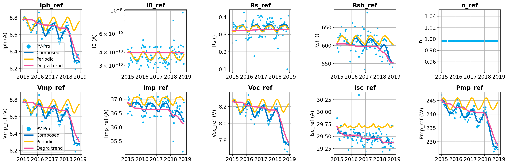

# PV Production Tools (PV-Pro)

[](https://pypi.org/project/pvpro/)


In a typical photovoltaic (PV) system, more information is stored than just the DC or AC power. When a dataset contains the DC voltage, DC current, module temperature and plane-of-array irradiance, we can fit a single-diode model and extract many parameters as a function of time. These parameters include series resistance, shunt resistance, reference photocurrent, and more.

This package, PV-Pro, automates the analysis of PV production data to extract the rate of change of these parameters. 

**The package is still under active development. If there is any problem, please feel free to contact us!**

## Publications
Details of PV-Pro are provided in the following publications:

[1] Li, Baojie, Todd Karin, Bennet E. Meyers, Xin Chen, Dirk C. Jordan, Clifford W. Hansen, Bruce H. King, Michael G. Deceglie, and Anubhav Jain. "Determining circuit model parameters from operation data for PV system degradation analysis: PVPRO." Solar Energy 254 (2023): 168-181. DOI: [10.1016/j.solener.2023.03.011](https://doi.org/10.1016/j.solener.2023.03.011)

[2] Li, Baojie, Todd Karin, Xin Chen, and Anubhav Jain. "Estimation and Degradation Analysis of Physics-based Circuit Parameters for PV Systems Using Only DC Operation and Weather Data." In 2022 IEEE 49th Photovoltaics Specialists Conference (PVSC), pp. 1236-1236. IEEE, 2022. DOI: [10.1109/PVSC48317.2022.9938484](https://doi.org/10.1109/PVSC48317.2022.9938484)

# Methods
PV-Pro estimates essential PV module parameters using only operation (DC voltage and current) and weather data (irradiance and temperature). First, PV-Pro performs multi-stage data pre-processing to remove noisy data. Next, the time-series DC data are used to fit an equivalent circuit single-diode model (SDM) to estimate the circuit parameters by minimizing the differences between the measured and estimated values. In this way, the time evolutions of the SDM parameters are obtained.


Here's a high level overview of the most important parts of the package.

- preprocess.Preprocessor - class for running the pre-processing of time-series data.
- main.PvProHandler - class method for running the parameter estimation. 
- postprocess.PostProcessor - class for running the post-processing of PV-Pro results.
- plotting.PvProPlot - class to plot figures conveniently

# Installation

## Install with pip
```
pip install pvpro
```


## Install with conda

Install can be performed with the included `pvpro-user.yml` file by running:

```
conda env create -f pvpro-user.yml
```
Next activate the environment, cd into the pvpro repository and run:

```
pip install -e .
```

## Install Mosek solver

The pre-processing part of PV-Pro relies on the [solar-data-tools](https://github.com/slacgismo/solar-data-tools), which requires the installation of [Mosek](https://www.mosek.com/resources/getting-started/) solver. MOSEK is a commercial software package. You will still need to obtain a license. More information is available here:

* [Free 30-day trial](https://www.mosek.com/products/trial/)
* [Personal academic license](https://www.mosek.com/products/academic-licenses/)

## Make environment manually
Another way to make a valid virtual environment is with the following commands. This section will be updated in the future to make a more minimal environment.

```
conda create --name pvpro python=3 numpy scipy pandas matplotlib cvxpy tqdm pyqt
conda activate pvpro
conda install -c mosek mosek
pip install requests
pip install sklearn
pip install seaborn
pip install xlrd
pip install solar-data-tools statistical-clear-sky
pip install NREL-PySAM
pip install matplotlib==3.3.2
```

# Examples

## Run analysis on synthetic data

By generating a PV dataset with known module degradation, the performance of the algorithm in extracting single diode model parameters can be tested. A jupyter notebook showing the generation of dataset and analysis of this dataset is provided in [Synthetic_analyze.ipynb](examples/Synthetic_analyze.ipynb). 


Estimated evolution trends of parameters show good match with the ground truth.

## Example analysis of real data.

The [NIST ground array dataset](https://pvdata.nist.gov/) provides a useful testbed for PV-Pro. A jupyter notebook showing analysis of this dataset is provided in [NIST_ground_array_analysis.ipynb](examples/NIST_ground_array_analysis.ipynb). 

PVPRO analysis fits a single diode model to the data at each timestep in the analysis. The trend of these parameters over time can be used to interpret what is degrading in the system. This analysis is only sensitive to module degradation (excepting drift in sensors) and not inverter degradation or downtime. Below, the PV-Pro results for this system show which parameters cause the observed power loss.


For this dataset, the estimated power degradation rate is -1.07%/yr. PV-Pro also reveals that the system appears to show a sharp decrease of current over time.

**[NEW] Post-processing functions** (based on [solar-data-tools](https://github.com/slacgismo/solar-data-tools)) of PV-Pro results are recently introduced, which can estimate a “clean” trend of the parameter changes over time with _noise and seasonality_ removed.



_After removing the noise and seasonality, clear degradation trends of parameters are revealed. The NIST ground system appears to show a slight increase of Rs and a decrease of Rsh over time._

### Contributors to this content:
Baojie Li, Todd Karin.

### Contributors to PV-Pro project:
Baojie Li (LBL), Todd Karin (PVEL), Bennet E. Meyers (SLAC), Xin Chen (LBL), Dirk C. Jordan (NREL), Clifford W. Hansen (Sandia), Bruce H. King (Sandia), Michael G. Deceglie (NREL), Anubhav Jain (LBL)


