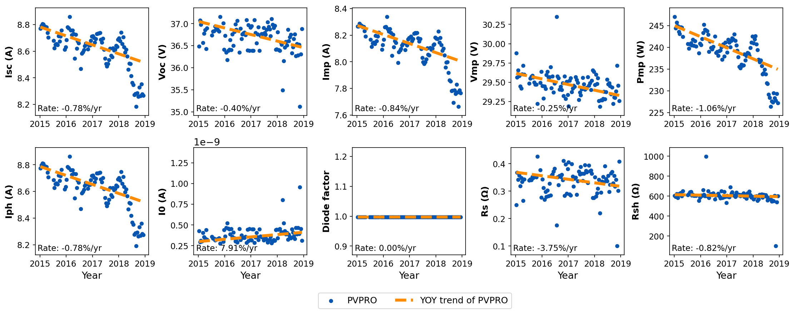

# PV Production Tools (PV-Pro)

[](https://pypi.org/project/pvpro/)


In a typical photovoltaic (PV) system, more information is stored than just the DC or AC power. When a dataset contains the **Production** (DC voltage & DC current) and **Weather data** (module temperature and plane-of-array irradiance) , we can fit and reconstruct a **precise physical model** of the PV system. This model serves to:

 - **Identify the degradation trend and rate** of key PV parameters
 - **Perform irradiance-to-power conversion** for accurate power prediction

**The package is still under active development. If there is any problem, please feel free to [contact us](mailto:baojieli@lbl.gov)!**

# Publications
Details of PV-Pro are provided in the following publications. If you use PV-Pro in a published work, please also cite:

[1] Li, B., et al. "Determining circuit model parameters from operation data for PV system degradation analysis: PVPRO." Solar Energy 254 (2023): 168-181. DOI: [10.1016/j.solener.2023.03.011](https://doi.org/10.1016/j.solener.2023.03.011)

[2] Li, B., et al. "Estimation and Degradation Analysis of Physics-based Circuit Parameters for PV Systems Using Only DC Operation and Weather Data." In 2022 IEEE 49th Photovoltaics Specialists Conference (PVSC), pp. 1236-1236. IEEE, 2022. DOI: [10.1109/PVSC48317.2022.9938484](https://doi.org/10.1109/PVSC48317.2022.9938484)

# Installation

```
pip install pvpro
```

### Install Mosek solver (Optional)

Pre-processing of PV-Pro could use [solar-data-tools](https://github.com/slacgismo/solar-data-tools) for better performance (optional), which requires the installation of [Mosek](https://www.mosek.com/resources/getting-started/) solver. MOSEK is a commercial software package. You will still need to obtain a license. More information is available here:

* [Free 30-day trial](https://www.mosek.com/products/trial/)
* [Personal academic license](https://www.mosek.com/products/academic-licenses/)


# Methods
PV-Pro estimates essential PV module parameters using only operation (DC voltage and current) and weather data (irradiance and temperature). First, PV-Pro performs multi-stage data pre-processing to remove noisy data. Next, the time-series DC data are used to fit an equivalent circuit single-diode model (SDM) to estimate the circuit parameters by minimizing the differences between the measured and estimated values. In this way, the time evolutions of the SDM parameters are obtained.


Here's a high level overview of the most important parts of the package.

- preprocess.Preprocessor - class for running the pre-processing of time-series data.
- main.PvProHandler - class method for running the parameter estimation. 
- postprocess.PostProcessor - class for running the post-processing of PV-Pro results.
- plotting.PvProPlot - class to plot figures conveniently


# Application Examples

## Degradation analaysis

The [NIST ground array dataset](https://pvdata.nist.gov/) provides a useful testbed for PV-Pro. A jupyter notebook showing analysis of this dataset is provided in [NIST_ground_array_analysis.ipynb](examples/NIST_ground_array_analysis.ipynb). 

PVPRO analysis fits a single diode model to the data at each timestep in the analysis. The trend of these parameters over time can be used to interpret what is degrading in the system. This analysis is only sensitive to module degradation (excepting drift in sensors) and not inverter degradation or downtime. Below, the PV-Pro results for this system show which parameters cause the observed power loss.



For this dataset, the estimated power degradation rate is -1.07%/yr. PV-Pro also reveals that the system appears to show a sharp decrease of current over time.

## Irradiance-to-power conversion 


Using the same NIST dataset


# Contribution

### Contributors to this content:
Baojie Li, Todd Karin.

### Contributors to PV-Pro project:
Baojie Li (LBL), Todd Karin (PVEL), Bennet E. Meyers (SLAC), Xin Chen (LBL), Dirk C. Jordan (NREL), Clifford W. Hansen (Sandia), Bruce H. King (Sandia), Michael G. Deceglie (NREL), Anubhav Jain (LBL)


